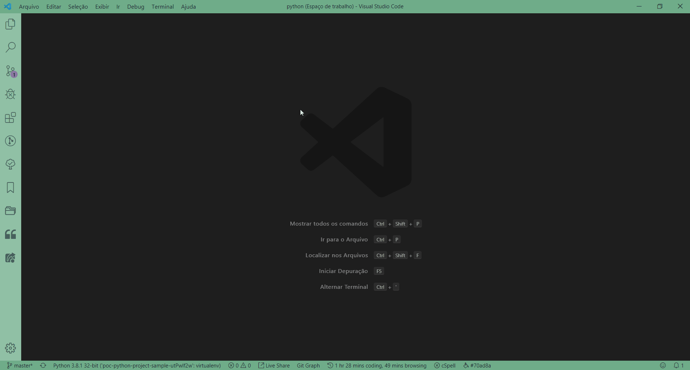

# GCP FUNCTION POC-PYTHON-PROJECT-SAMPLE-GCP-FUNCTIONS

Exemplo de Arquitetura de projeto python usado na Google Cloud Functions.

Segue o modelo para atender a qualquer tipo de projeto standalone com pacotes internos caso necessario:

```
    helloworld/
│
├── bin/
│
├── docs/
│   ├── hello.md
│   └── world.md
│
├── helloworld/
│   ├── __init__.py
│   ├── runner.py
│   ├── hello/
│   │   ├── __init__.py
│   │   ├── hello.py
│   │   └── helpers.py
│   │
│   └── world/
│       ├── __init__.py
│       ├── helpers.py
│       └── world.py
│
├── data/
│   ├── input.csv
│   └── output.xlsx
│
├── tests/
│   ├── hello
│   │   ├── helpers_tests.py
│   │   └── hello_tests.py
│   │
│   └── world/
│       ├── helpers_tests.py
│       └── world_tests.py
│
├── .gitignore
├── LICENSE
└── README.md
```
Descrição de cada pasta:
```
bin/: This directory holds any executable files. I’ve adapted this from Jean-Paul Calderone’s classic structure post, and his prescriptions for the use of a bin/ directory are still important. The most important point to remember is that your executable shouldn’t have a lot of code, just an import and a call to a main function in your runner script. If you are using pure Python or don’t have any executable files, you can leave out this directory.

/docs: With a more advanced application, you’ll want to maintain good documentation of all its parts. I like to put any documentation for internal modules here, which is why you see separate documents for the hello and world packages. If you use docstrings in your internal modules (and you should!), your whole-module documentation should at the very least give a holistic view of the purpose and function of the module.

helloworld/: This is similar to helloworld/ in the previous structure, but now there are subdirectories. As you add more complexity, you’ll want to use a “divide and conquer” tactic and split out parts of your application logic into more manageable chunks. Remember that the directory name refers to the overall package name, and so the subdirectory names (hello/ and world/) should reflect their package names.

data/: Having this directory is helpful for testing. It’s a central location for any files that your application will ingest or produce. Depending on how you deploy your application, you can keep “production-level” inputs and outputs pointed to this directory, or only use it for internal testing.

tests/: Here, you can put all your tests—unit tests, execution tests, integration tests, and so on. Feel free to structure this directory in the most convenient way for your testing strategies, import strategies, and more. For a refresher on testing command-line applications with Python, check out my article 4 Techniques for Testing Python Command-Line (CLI) Apps.
```


## Pipefy

###### PIPE

* [Nome do Pipe](https://app.pipefy.com/)

###### Google Cloud Platform

* [NOME DA FUNCTION](https://console.cloud.google.com/functions/)

###### EMPRESA - Abertura de Demandas Innovation HISTORY

* DD/MM/YYYY
    * [Nome da Demanda](https://app.pipefy.com/)

## Pré Requisitos

Desenvolvido no Visual Code Studio (VS Code):

* [Visual Code Studio](https://code.visualstudio.com/)

Fazer a instalação do python:

* [Python.org](https://www.python.org/downloads/)

Instalar o pacote pipenv atraves do seguinte comnado
```
    pip install pipenv
```

## Configuração para Desenvolvimento

* Importar como Projeto Maven no VS Code:

```
	Arquivo -> Adicionar Pasta ao Workspace
```

* Rodar o seguinte comando no terminal na pasta do projeto para instalar as dependencias

```
pipenv shell
pipenv install --dev
```

* Para instalar qualquer pacote só rodar o comando abaixo

```
pipenv install <nome do pacote>
```
Ex:
```
pipenv install requests
```

* Especificamente no VS code colocar a vm virtual do python no arquivo de configuração do vs code:

1. Rode o seguinte comando para saber a url da vm virtual do python
```
pipenv --venv
```
2. Abrir o arquivo settings.json do projeto e inserir a VM Virtual conforme abaixo:



3. Substitua o valor da propriedade python.pythonPath com o caminho mostrado, deixando somente o final da VM apos Scripts:

Exemplo do Valor da VM virtual:
```
C:\Users\myuser\.virtualenvs\poc-python-project-sample-gcp-functions-eNpsXMsB
```

Exemplo do Valor que é para substituir:
```
C:\\Users\\myuser\\.virtualenvs\\poc-python-project-sample-gcp-functions-eNpsXMsB\\Scripts\\python.exe
```

## Deploy no Google Cloud Functions 

1. Execute o comando para atualizar o arquivo pipenv.lock
```
pipenv lock
pipenv install --ignore-pipfile
```

2. Gere um arquivo zip do projeto inteiro do python, ele deve ter a mesma estrutura ao abrir o zip:

* Correto
```
helloworld/
└── Arquivos do projeto
```

* Errado
```
helloworld/
└── helloworld/
    └── Arquivos do projeto
```

2. Ao ***Criar uma Função***, suba atraves da opção upload do zip
3. Na opção ***Intervalo de armazenamento***, selecione a pasta da sua empresa, caso não tenha é necessário criar
4. Na opção ***Função a ser executada*** coloque o metodo main

## REFERENCIAS

* [Python Application Layouts: A Reference](https://realpython.com/python-application-layouts/)
* [Pipenv: A Guide to the New Python Packaging Tool](https://realpython.com/pipenv-guide/)
* [Configuring Pipenv in Visual Studio Code](https://olav.it/2017/03/04/pipenv-visual-studio-code/)
* [Quickstart on Pipenv (Python packaging tool)](https://dev.to/smirza/quickstart-guide-on-pipenv-python-packaging-tool-2ie4)
* [Why you should use pyenv + Pipenv for your Python projects](https://hackernoon.com/reaching-python-development-nirvana-bb5692adf30c)

## TECNOLOGIAS UTILIZADAS

* [Python™](https://spring.io/projects/spring-boot)
* [Google Cloud Functions™](https://cloud.google.com/functions/?hl=pt-br)
* [Requests: HTTP for Humans™](https://requests.readthedocs.io/en/master/)
* [Pipenv](https://github.com/pypa/pipenv)
* [APACHE LICENSE, VERSION 2.0](http://www.apache.org/licenses/LICENSE-2.0)